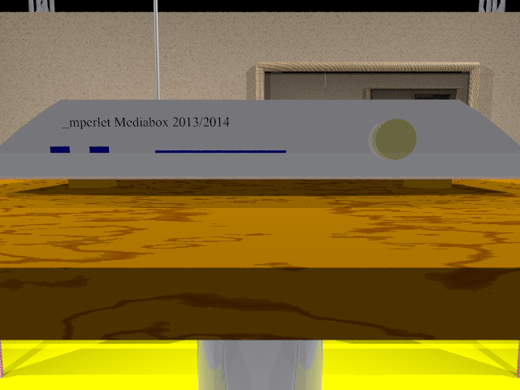
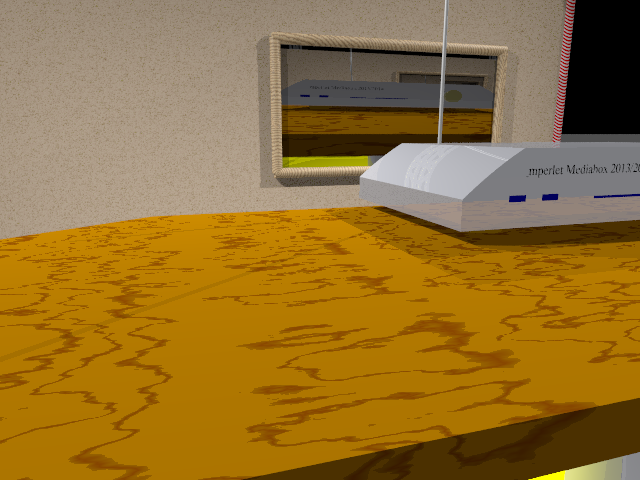
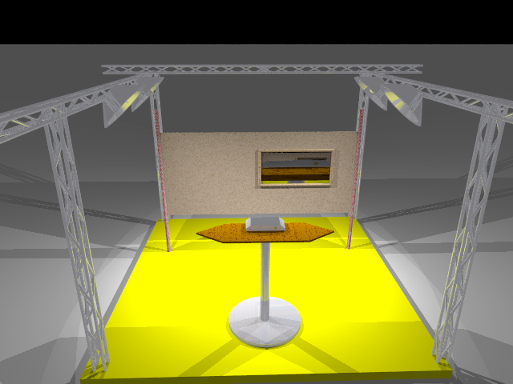

#### Aufgabe 1: 3 Bauteile für die Fronseite
Es wurden zwei USB-Ports, ein Kartenleser sowie ein Drehschalter in der
Datei `mediabox_object.inc` mithilfe von CSG-Operationen modelliert.
Als extra wurde ein Schriftzug auf der Mediabox plaziert.

#### Aufgabe 2: Multimediabox
Die Multimediabox wird komplett in der Datei `mediabox_object.inc`
beschrieben. Als Textur wurde `Silver_Metal` verwendet. Die Ecken wurden
mithile eines Zylinders und der *intersection* Operation modelliert.

#### Aufgabe 3: Tisch
Der Tisch wird in der Datei `tisch_object.inc` beschrieben.
Er bestelt aus zwei Zylindern, einer für das Tischbein, der andere für
den Tischfuß. Die Tischplatte wurde mithilfe eines Prismas modelliert.
Die Textur für die Tischplatte ist `Tom_Wood`.

#### Aufgabe 4: Messestand
Die gesamte Szene wird in der Datei `mediabox.pov` beschrieben.
Für den Messestand wurde eine gelbe Bühne (3,5m x 3,5m) modelliert.
Auf dem Messestand befindet sich eine Tafel (modelliert in `tafel_object.inc`).
Sie besteht aus 2 Ständern und einer Holzplatte. Für den Messestand wurde zusätzlich
ein Gerüst konstruiert (in der Datei `geruest_object.inc`).
Im Zentrum steht die Mediabox auf einem Tisch. Auf einem Himmel und Fußboden wurde
absichtlich verzichtet, da sich der Messestand nicht unter freiem Himmel befindet.

#### Aufgabe 5: Kamera
Die verschiedenen Kamerapositionen werden in der Datei `mediabox.pov`
 *Zeile 12 - 24* festgelegt. Die Spotlichter wurden mit Kegelstumpfen modelliert.
 
#### Aufgabe 6: Poster
Das Poster wurde mit meinem Rahmen verziert und wird in der Datei `tafel_object.inc`
beschrieben. Das Poster wird mithilfe **image_map** und einer Bild-Datei modelliert.
Als Bild-Datei wird das gerenderte Bild `mediabox_front.png` benutzt.

---------

# Frontansicht

# Interessante Ansicht

# Umfassende Ansicht

